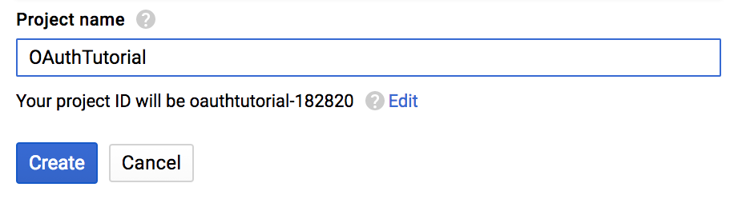
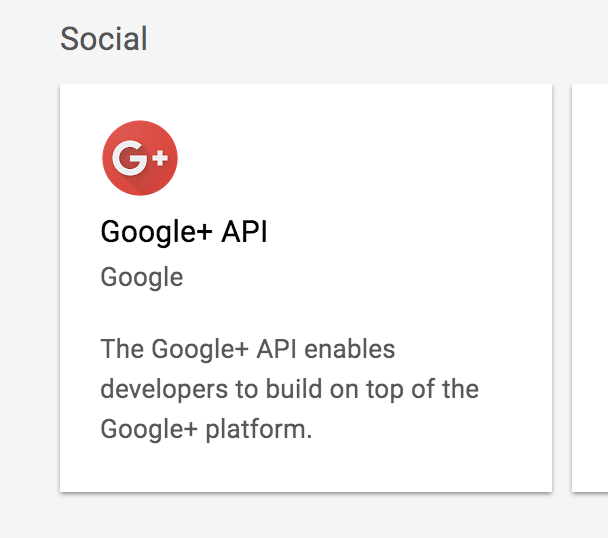
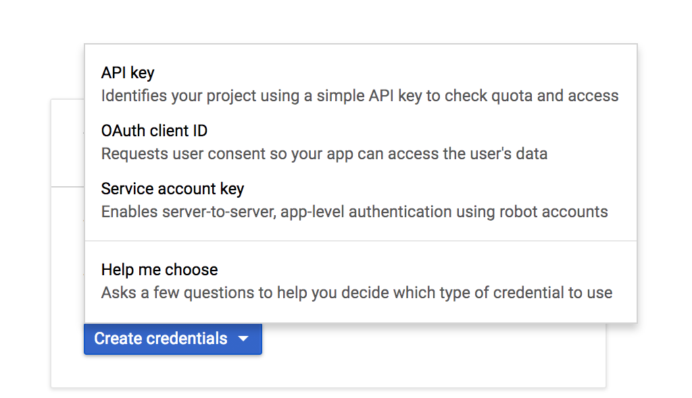
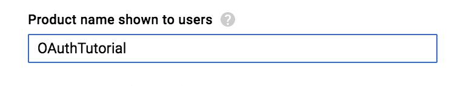
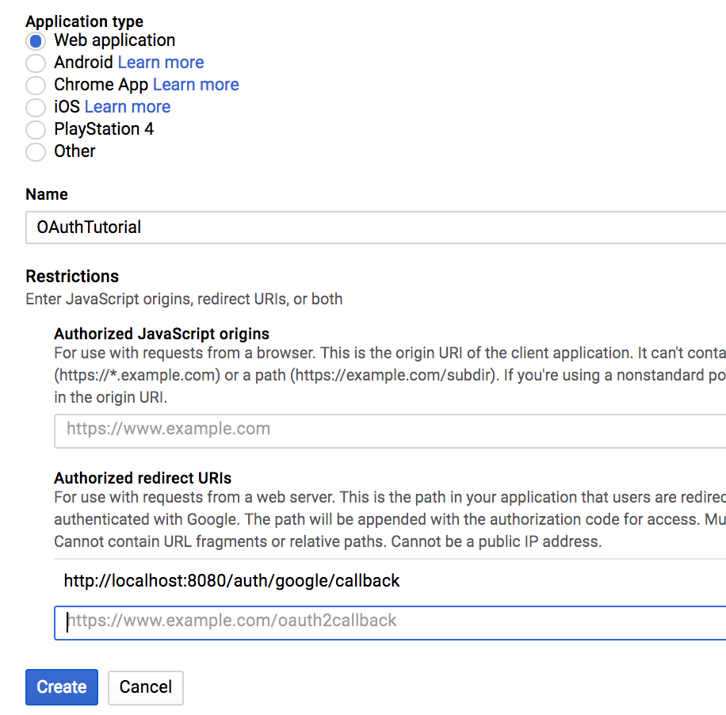
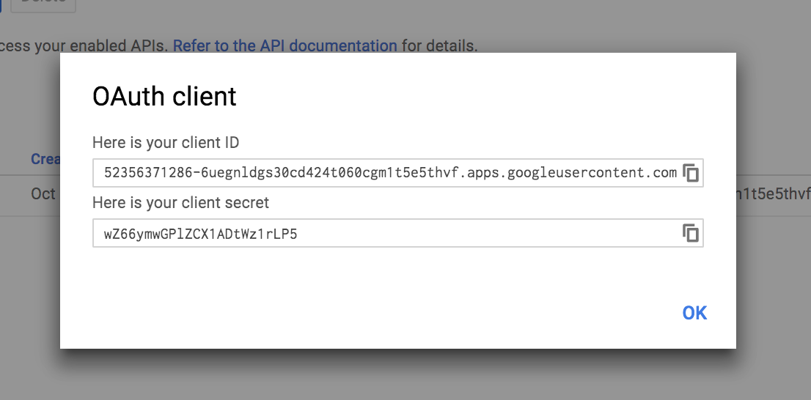

# OAuth 2.0 Tutorial

## About

In this tutorial, we will build the simplest possible Node/Express web app that lets users log in with their Google accounts and persist their session to the browser. Many tutorials on the topic can be very comprehensive and focused on implenting Oauth with large frameworks on the frontend and ORM's on the backend. Not this one. We will have it up and running in 30 minutes, in a form that should be well adaptable to any Node/Express backend.

## Phase 0
First we will get everything set up for success. Start by visiting https://console.developers.google.com/projectselector/apis/library and selecting 'Create'. This will help us get a new clientID for our app, which verifies to Google that we're authorized to use their API. NOTE: This will be a slightly different process for each Oauth provider (Facebook, Twitter, etc...), but will often consist of similar steps.

- First, enter a project name and click 'Create', you will be given a project ID. Save it somewhere, it may be useful for your app later. (Not for ours!)

---
- Next, find Google+ API in the list of API's. Click on this item and then click 'Enable'.

---
- Now that Google+ API is enabled, go to the left menu and click 'Credentials'. Select 'Create Credentials' and you will open a modal where you can select 'OAuth client ID'.

---
 - You will be told that you that you must create a consent screen before editing Credentials. Click 'Configure consent screen' in the top right corner, and just enter your project name and 'Save'. You can customize this menu for your own apps in the future.

---
- Now you are at the credentials page. Select 'Web Application' and fill in your project name and the following path under 'Authorized redirect URIs'. This is the URL that google will use to send information back to our app. After you are done, hit 'Create'.

---
- Lastly, copy your clientID and client secret into an empty file, and we will use these in our app!

---
We are now setup to use Google+ API in our new app. Before we can start building, we must make sure we have PostgreSQL installed and running on our computer.

From the command line, run `psql` to open PostgreSQL. Type in the following command to create a new database titled `OAuthTutorial`. Don't forget the semicolon.

`CREATE DATABASE OAuthTutorial;`

Now create a new directory titled whatever you'd like, and run `npm init --yes` in the terminal to create a package.json file in this directory.

### Node Modules We Will Use
- `babel-cli` --- transpiles our fancy ES6 code into less fancy ES5 code
- `babel-preset-es2015` --- ES6 preset
- `body-parser` --- used for sending form data in express requests
- `ejs` --- for rendering HTML embedded with javascript
- `express` --- for running our backend server
- `express-session` --- for storing our session tokens
- `nodemon` --- watches for changes and restarts our backend server
- `passport` --- for Oauth
- `passport-google-oauth` --- for Google implementation specifically
- `pg` --- for connecting to our Postgres database and making queries

Run `npm install --save module1 module2 ...` to install the node modules above. Woot! We are ready to start coding!

## Phase 1

Now for the fun stuff. Let's create a file called `server.js` and start a basic express server. Put this file in a folder called `backend`.

``` javascript
import express from 'express';
import bodyParser from 'body-parser';

const app = express();

app.use(bodyParser.urlencoded({ extended: true }));

app.listen(3000, () => {
  console.log('Example app listening on port 3000!');
});
```
This is pretty standard boiler-plate express code. You may be curious about what `bodyParser` is doing. This enables frontend forms to ship data along with POST requests to our Express backend. Although we won't have any forms to worry about, it will help us test our database connection with Postman.

We can try and run this file and start the server with the command `node backend/server.js`, but our ES6 code will cause the server to break. Additionally, it would break every time we updated our code in the future. Let's run the server with `nodemon` so we don't have to worry about ES6 or continually restarting our server. Add the following script under `"start"` to your `package.json`.

```
"scripts": {
  "test": "echo \"Error: no test specified\" && exit 1",
  "start": "nodemon backend/server.js --exec babel-node --presets es2015"
},
```

Go ahead and run `npm start` from the root directory and verify that everything's working before moving on.

## Phase 2

Now let's test our connection to our database by writing some simple controller actions and routes. Make two new files in `backend` called `routes.js` and `controller.js`. First, let's write a controller that will fetch all users in our database. We can quickly set up our test routes with the following few lines of code.

```
import * as controller from './controller.js';

export const routerConfig = (app, passport) => {
  app.get('/api/users', controller.getAllUsers);
  app.get('/api/users/:userId', controller.fetchUser);
};
```
