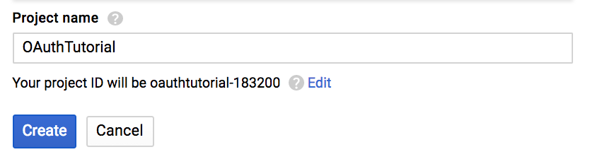
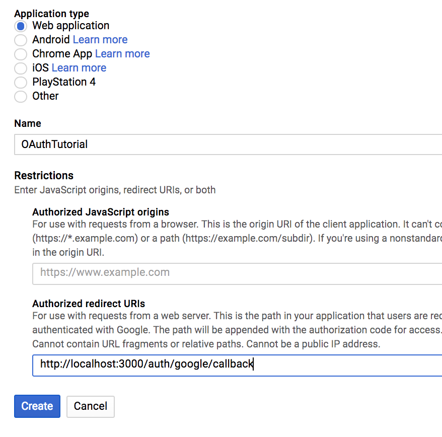

# OAuth 2.0 Tutorial

## About

In this tutorial, we will build the simplest possible Node/Express web app that lets users log in with their Google accounts and persist their session to the browser. Many tutorials on the topic can be very comprehensive and focused on implenting Oauth with large frameworks on the frontend and ORM's on the backend. Not this one. Our goal will be to have it up and running in 30 min, in a form that's easily altered to fit any Node backend.

## Phase 0
First we will get everything set up for success. Start by visiting https://console.developers.google.com/projectselector/apis/library and selecting 'Create'. This will help us get a new clientID for our app, which verifies to Google that we're authorized to use their API. NOTE: This will be a slightly different process for each OAuth provider (Facebook, Twitter, etc...), but will often consist of similar steps.

- First, enter a project name and click 'Create', you will be given a project ID. Save it somewhere, it may be useful for your app later. (Not for ours!)

---
- Next, find Google+ API in the list of API's. Click on this item and then choose 'Enable'.

---
- Go to the left menu and click 'Credentials'. Select 'Create Credentials' and you will open a modal where you can select 'OAuth client ID'.

---
 - You will be told that you that you must create a consent screen before editing Credentials. Click 'Configure consent screen' in the top right corner, and just enter your project name and 'Save'. You can customize this menu for your own apps in the future.

---
- Now you are at the credentials page. Select 'Web Application' and fill in your project name and the following path under 'Authorized redirect URIs'. This is the URL that google will use to send information back to our app. After you are done, hit 'Create'.

---
- Lastly, copy your clientID and client secret into an empty file, and we will use these in our app!

---
We are now setup to use Google+ API. However, before we can start building, we must have a database to work with. For this tutorial, make sure you have PostgreSQL installed and running on our computer. If you'd like to use a different database, the logic presented here should be easily adaptable.

From the command line, run `psql` to open PostgreSQL. Type in the following command to create a new database titled `OAuthTutorial`. Don't forget the semicolon.

`CREATE DATABASE OAuthTutorial;`

Now create a new directory titled whatever you'd like, and run `npm init --yes` in the terminal to create a package.json file in this directory.

### Node Modules We Will Use
- `babel-cli` --- transpiles our fancy ES6 code into less fancy ES5 code
- `babel-preset-es2015` --- ES6 preset
- `body-parser` --- for sending form data in express requests
- `ejs` --- for rendering HTML embedded with javascript
- `express` --- for running our backend server
- `express-session` --- for storing our session tokens
- `nodemon` --- watches for changes and restarts our backend server
- `passport` --- for Oauth
- `passport-google-oauth` --- for Google implementation specifically
- `pg` --- for connecting to our Postgres database and making queries

Run `npm install --save module1 module2 ...` to install the node modules above. Woot! We are ready to start coding!

## Phase 1

Now for the fun stuff. Let's create a file called `server.js` and start a basic express server. Put this file in a folder called `backend`.

``` javascript
import express from 'express';
import bodyParser from 'body-parser';

const app = express();

app.use(bodyParser.urlencoded({ extended: true }));

app.listen(3000, () => {
  console.log('Example app listening on port 3000!');
});
```
This is pretty standard boiler-plate express code. You may be curious about what `bodyParser` is doing. This enables frontend forms to ship data along with POST requests to our Express backend. Although we won't have any forms to worry about, it will help us test our database connection with Postman.

We can try and run this file and start the server with the command `node backend/server.js`, but our ES6 code will cause the server to break. Additionally, it would break every time we updated our code in the future. Let's run the server with `nodemon` so we don't have to worry about ES6 or continually restarting our server. Add the following script under `"start"` to your `package.json`.

``` javascript
"scripts": {
  "test": "echo \"Error: no test specified\" && exit 1",
  "start": "nodemon backend/server.js --exec babel-node --presets es2015"
},
```

Go ahead and run `npm start` from the root directory and verify that everything's working before moving on.

## Phase 2

Now let's test our connection to our database by writing some simple controller actions and routes. Make two new files in the `backend` folder called `routes.js` and `controller.js`.

First, let's write a function in `controller.js` that will fetch all users in our database. Each Express controller function takes a request and response as arguments, and generally follow these steps:
- Open a connection to the database. (unless using an ORM)
- Query the database for the information you need.
- If found, send the data in the response argument as JSON.
- If something goes wrong, send an error in the response.
- Close the connection to the database after all queries are complete so another future connection can be made. (unless using an ORM)

``` javascript
//controller.js

const pg = require('pg');
const connectionString = process.env.DATABASE_URL || 'postgres://localhost/OAuthTutorial';

export const getAllUsers = (req, res) => {
  const client = new pg.Client(connectionString);
  client.connect(err => {
    client.query("SELECT * FROM users")
      .then(data => res.status(200).json({ users: data.rows }))
      .then(() => client.end());
  })
};
```

We can quickly set up our test route with the following few lines of code in `routes.js`. Any future routes can be listed right inside the `routerConfig` function. This will act as a middleware plugin for our app object. Go ahead and import the `routerConfig` function to `server.js` and invoke before the final call to `app.listen`.

``` javascript
//routes.js

import * as controller from './controller.js';

export const routerConfig = app => {
  app.get('/api/users', controller.getAllUsers);
};

//server.js

import express from 'express';
import bodyParser from 'body-parser';
import { routerConfig } from './routes.js';

const app = express();

app.use(bodyParser.urlencoded({ extended: true }));

routerConfig(app);

app.listen(3000, () => {
  console.log('Example app listening on port 3000!');
});
```

Since our backend is being served by nodemon, we can see if there are any users in our database by making a GET request to http://localhost:3000/api/users.


Explore writing the entire CRUD cycle in these two files and test with Postman! This is how we create a simple RESTful API in Node.js.

## Phase 3

Now that we have some controllers and routes to work with, we can add our passport logic to start making requests for user information right to Google.

Remember the clientID and clientSecret from before? We will need these. Throw a nested object containing these and our Google callbackURL in a new file in `backend` called `util.js` and export it.

``` javascript
export const googleConfig = {
  clientID: '71042043336-1q1fhgjrj3b4k1inke8vo5u1gsqfq8vp.apps.googleusercontent.com',
  clientSecret: 'tnGu6VIAjKvaqBy1Yz5a47JU',
  callbackURL: 'http://localhost:3000/auth/google/callback'
};
```

The following code is the heart of this tutorial. Let's put it in another new file in `backend` called `passport.js`. In here, we will create another piece of middleware for our soon-to-exist passport object that adds an OAuth2Strategy containing our app's sensitive information. This is fairly boiler-plate code, with helper methods doing their best to filter out the logic specific to our use of Postgres. In other words, `findUserById` and `findOrCreateUser` are functions that can be rewritten to use another database or ORM, without changing our `passportConfig` logic in any way.

``` javascript
//passport.js

import pg from 'pg';
import { OAuth2Strategy as GoogleStrategy } from 'passport-google-oauth';
import { googleConfig } from './util.js';

const connectionString = process.env.DATABASE_URL || 'postgres://localhost/auth0tutorial';

export const passportConfig = (passport) => {
  // used to serialize the user for the session
  passport.serializeUser((user, done) => done(null, user.id));
  // used to deserialize the user
  passport.deserializeUser((id, done) => findUserById(id, done));

  passport.use(new GoogleStrategy({
    clientID: googleConfig.clientID,
    clientSecret: googleConfig.clientSecret,
    callbackURL: googleConfig.callbackURL,
  },
  (token, refreshToken, profile, done) => {
    process.nextTick(() => findOrCreateUser(token, profile, done));
  }));
}

//helper functions for passportConfig

const findUserById = (id, done) => {
  const client = new pg.Client(connectionString);
  client.connect(err => {
    client.query(`SELECT * FROM users WHERE id=\'${id}\'`)
    .then(
      data => {
        const user = data.rows[0];
        done(null, user);
      },
      err => done(err, null)
    )
    .then(() => client.end());
  });
};

const findOrCreateUser = (token, profile, done) => {
  const client = new pg.Client(connectionString);
  client.connect(err => {
    client.query(`SELECT * FROM users WHERE googleId=\'${profile.id}\'`)
    .then(
      foundUsers => {
        let user = foundUsers.rows[0];
        if (user) {
          done(null, user);
        } else {
          client.query(`INSERT INTO users (name, email, avatar, googleId, token) VALUES (\'${profile.name.givenName}\', \'${profile.emails[0].value}\', \'${photoUrlHelper(profile.photos[0].value)}\', \'${profile.id}\', \'${token}\') RETURNING *`)
          .then(
            createdUsers => done(null, createdUsers.rows[0]),
            err => done(err, null)
          );
        }
      }
    )
    .then(() => client.end());
  });
};

//Google Profile Img url comes with query string tagged on to make image size tiny, so this cuts it off
const photoUrlHelper = (url) => {
  return url.substr(0, url.indexOf('?'));
};
```

## Phase 4

Cleanup time. Let's update our `routes.js` and `server.js` to involve this passport logic, and make some views for the frontend.

First, we will add several new routes as well as a second passport argument to `routerConfig`. Then we just need to add our passport and session middleware to `server.js`

``` javascript
//routes.js

import * as controller from './controller.js';
import path from 'path';

//helper function
const isLoggedIn = (req, res, next) => {
  if (req.isAuthenticated()) {
    return next();
  }
  res.redirect('/');
}

export const routerConfig = (app, passport) => {
  app.get('/api/users', controller.getAllUsers);

  //login route
  app.get('/', (req, res) => {
    res.sendFile(path.join(__dirname, '../frontend/login.html'));
  });

  //protected profile route. Try it in your browser when logged out.
  app.get('/profile', isLoggedIn, (req, res) => {
    console.log(req.user);
    res.render(path.join(__dirname, '../frontend/profile.ejs'), {
      user: req.user
    });
  });

  //logout route
  app.get('/logout', (req, res) => {
    //flips the isAuthenticated property sent in the request of successRedirect to false
    req.logout();
    //eliminates token saved by express-session
    req.session.destroy();

    res.redirect('/');
  });

  //google request route, can be altered to include more user information
  app.get('/auth/google',
    passport.authenticate('google', {
      scope : ['profile', 'email']
    })
  );

  //google response route with appropriate redirects
  app.get('/auth/google/callback',
    passport.authenticate('google', {
      successRedirect: '/profile',
      failureredirect: '/'
    })
  );
}
```

``` javascript
//server.js

import express from 'express';
import bodyParser from 'body-parser';
import passport from 'passport';
import session from 'express-session';
import * as controller from './controller.js';
import { passportConfig } from './passport.js';
import { routerConfig } from './routes.js';

const app = express();

app.use(bodyParser.urlencoded({ extended: true }));

app.use(session({
  secret: 'PutAnythingYouWantHere',
  saveUninitialized: false,
  resave: false,
}));

passportConfig(passport);
app.use(passport.initialize());
app.use(passport.session());

routerConfig(app, passport);

app.listen(3000, () => {
  console.log('Example app listening on port 3000!');
});
```
To mimic a frontend, we will add a `frontend` folder and two new files `login.html` and `profile.ejs`. The login page will present a button that directs to our `auth/google` route. The profile page will be a protected route that can only be reached after successfully logging in.

Since your frontend will completely replace these two files, there's no need to dive into the specifics. Copy and paste or clean to your desired satisfaction.

``` xml
<!-- login.html -->

<!DOCTYPE html>
<html>
  <head>
    <meta charset="utf-8">
    <title>Auth0 Tutorial</title>
  </head>
  <body>
    <div id="root">
      <h1>Hi I'm your web application. Who are you?</h1>
      <a href="auth/google">
        <button>Google Login</button>
      </a>
    </div>
  </body>
</html>
```

``` xml
<!-- profile.ejs -->

<!DOCTYPE html>
<html>
  <head>
    <meta charset="utf-8">
    <title>Profile</title>
  </head>
  <body>
    <h1 style="display:inline-block">Nice to meet you <%= user.name %></h1>
    <a href="/logout"><button>Logout</button></a>
    >
  </body>
</html>
```

And there it is! We've done it! Be sure that all necessary dependencies are installed and included at the top of each file. Visit http://localhost:3000 and test it out!
